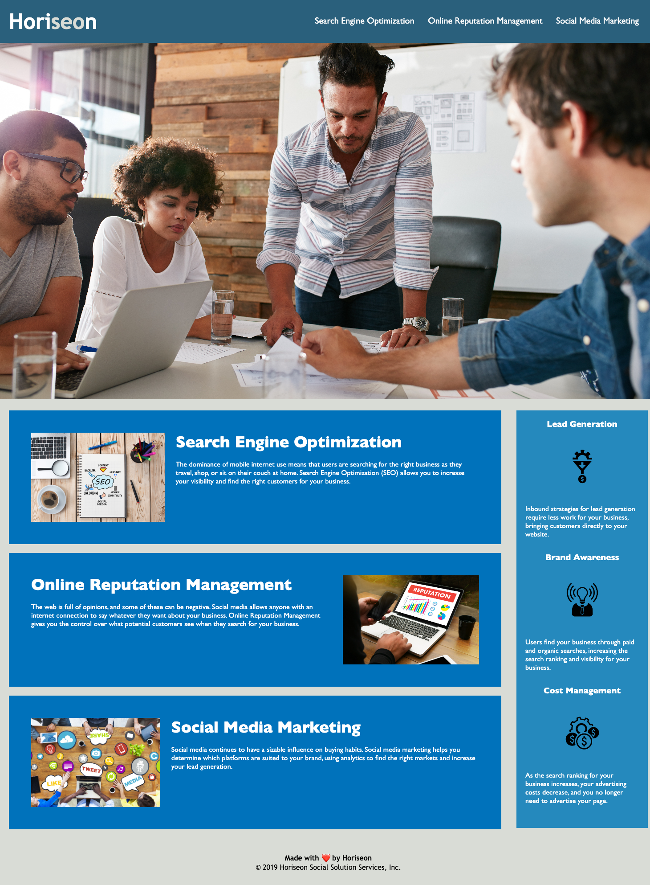

# Horiseon-Ahead
Coding Bootcamp Challenge #1 - HTML, CSS, Git

## Description 
This project for the first weeks of the DU Coding Bootcamp is testing our ability to refactor code on an existing application to be more accessible. 

    - Motivation was to provide the client (Horiseon) with a more accessible website.
    - Improved accessibility will improve SEO scores and allow clients with disabilities to access the content more readily through screen readers, braille keyboards, etc. 
    - This project is teaching me a) the importance of accessibility and b) the small ways to clean up code to make it easier for other developers to read and change later on. 

## Installation
NA

## Usage
This webpage serves as a landing page for Horiseon, a marketing company. The landing page contains information on the services they provide and why each component is important to building business. 

## Credits 
Started code from urban-octo-telegram https://github.com/coding-boot-camp/urban-octo-telegram

CSS Organization guidelines from https://developer.mozilla.org/en-US/docs/Learn/CSS/Building_blocks/Organizing

## License

Please refer to the LICENSE in the repo. 